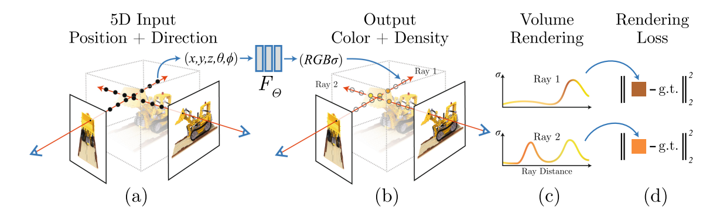

# nerfPytorch (multi GPU)
NeRF realize by Pytorch  
## content  
1. noval view 'lego' synthesis  
2. positional encoding by hash ecoding or freq encoding  
3. multi gpu realize  

## how to start?  
1. Download lego data from [datasets](https://drive.google.com/drive/folders/128yBriW1IG_3NJ5Rp7APSTZsJqdJdfc1)  
2. put 'lego' data directory into data/train_data/ directory  
3. start command  
```
python main.py
```
4. parameters
```
parser.add_argument("--basedir", type=str, default=currentdir,
                        help='where to store ckpts and logs')
parser.add_argument("--savedir", type=str, default=currentdir+'/experiments/1/',
                        help='where to store results')
parser.add_argument("--tinydatadir", type=str, default=currentdir+'/data/train_data/tiny_nerf_data.npz',
                        help='where load tiny lego data')
parser.add_argument("--legodatadir", type=str, default=currentdir+'/data/train_data/lego/',
                        help='where load full lego data')
parser.add_argument("--ifhash", type=int, default=0,
                        help='if use hash encoding')     
parser.add_argument("--numgpu", type=int, default=1,
                        help='numgpus')     
# if use tiny lega dataset   default:1
parser.add_argument("--iftiny", type=int, default=1,
                        help='if use tiny lega dataset')  
parser.add_argument("--numepoch", type=int, default=1000,
                        help='numepoch') 
parser.add_argument("--numcoast", type=int, default=64,
                        help='num coast')  
parser.add_argument("--numfine", type=int, default=64,
                        help='num fine')  
parser.add_argument("--chunksize", type=int, default=1024*32,
                        help='num chunk size')    
parser.add_argument("--nrand", type=int, default=200*200,
                        help='num random patch')    
parser.add_argument("--resscale", type=int, default=8,
                        help='resize scale') 

```
# NeRF  
## introduction
> [NeRF: Representing Scenes as Neural Radiance Fields for View Synthesis](https://www.matthewtancik.com/nerf)

NerF作为一种隐式神经表达三维场景的方式，在多视角二维图像监督下，渲染出三维场景，并且渲染结果是连续的，能够隐式将(x,y,z,**d**)坐标映射为($\sigma$,**c**)。$$f:(x,y,z,\vec{d})\Rightarrow(\sigma,\vec{c})\tag{1}$$其中**c**为RGB编码(**可以看作是散射光谱信息**)，仅与散射/漫反射物体的坐标(x,y,z)以及辐射方向**d**有关，也就是仅与观测物体的**材质、纹理以及辐射方向**有关，实际上RGB光谱信息同样随着照明光入射方向变化，由于NeRF在LDR场景下采集图像，可以看作照明光强和照明方向是均匀的(*这种情况下可以近似认为 **c** 与照明无关，在真实场景下可能需要对照明光场进行建模并且光谱数据需要表示为随照明变化的函数*)。  **c**并非物体本征特性，而是表示的是在一定照明条件下（均匀照明）散射光谱和强度变化分布，相当于在体密度表征的辐射强度基础上加入光谱、viewdependent信息，利用不同视角的c能够在照明已知条件下估计物体本征材质以及纹理。所以c重建结果实际上是物体本征材质和纹理与光照作用后的结果。
体密度$\sigma$作为一种物体本征特性的抽象，**实际上不仅仅代表密度这个物理量，而是作为影响辐射率(散射率或反射率，单位光子数照明下向外辐射的光子数)的一个抽象的参数**，与物体**材料纹理**有关，某一点的辐射率看作是体密度和体积的求积概率表示$1-exp(-\sigma\delta)$。体密度的增加会带来辐射率的增加，同时剩余光子数（辐射方向不发生变化）表示为$exp(-\sigma\delta)$，这里认为光与物质的作用仅仅是散射或漫反射消光，实际上物质还存在吸收消光。
NeRF模型对观测物体，照明条件做了一定的假设，认为观测物体为漫反射/散射物体（对场景的表示很明显为散射吸收模型），且由于辐射率仅与体密度这种本征参数有关，认为物体处于均匀照明假设下，**c**仅与空间点以及观测方向有关，因此同样认为是照明无关量。但是首先均匀照明在真实情况下难以做到，虽然可以通过相机后处理过程实现但是这种方法破坏了原始图像噪声分布从而导致渲染颜色发生变化([NeRF in the Dark](https://bmild.github.io/rawnerf/))。  
其次对于非漫反射/散射物体，比如对于镜面反射，在这种假设下无法准确估计体密度和深度，因为镜面反射物体的辐射强度和颜色与周围环境有关，此时估计出的是周围环境的体密度和颜色，而非镜面物体的参数([NeRFReN: Neural Radiance Fields with Reflections](https://bennyguo.github.io/nerfren/.))。
因此后续针对成像模型不完善或者不适用的场景涌现许多工作，包括解决[镜面反射导致体密度&深度估计不准确问题](https://bennyguo.github.io/nerfren/.)  ，[离焦]( https://github.com/zijinwuzijin/DoF-NeRF)，[畸变]( https://github.com/POSTECH-CVLab/SCNeRF )，[无限远场景采样](http://jonbarron.info/mipnerf360)，通过改进成像模型或采样方式使模型更接近于真实成像过程。
## Method
### 成像模型

整个成像模型可以表达为式(2)$$C(\mathbf{r})=\int_{t_{n}}^{t_{f}} T(t) \sigma(\mathbf{r}(t)) \mathbf{c}(\mathbf{r}(t), \mathbf{d}) d t, \text { where } T(t)=\exp \left(-\int_{t_{n}}^{t} \sigma(\mathbf{r}(s)) d s\right) \tag{2} $$ 
离散形式表达为(3) $$\hat{C}(\mathbf{r})=\sum_{i=1}^{N} T_{i}\left(1-\exp \left(-\sigma_{i} \delta_{i}\right)\right) \mathbf{c}_{i}, \text { where } T_{i}=\exp \left(-\sum_{j=1}^{i-1} \sigma_{j} \delta_{j}\right) \tag{3}$$成像模型看作是相机像素在物空间投影区域的辐射到达该像素的积分，T代表光线传播过程中受到前景点的消光，$\left(1-\exp \left(-\sigma_{i} \delta_{i}\right)\right)$代表辐射率，这两项与体密度$\sigma$有关。实现过程每个像素的物空间等效为一条光线(实际上这种在理想直线上采样的方式会导致高频信息混叠，后续[Mip-NeRF](https://jonbarron.info/mipnerf/)的工作则针对这一问题将物空间等效为三维高斯分布)，对于每个像素都能够根据小孔成像模型映射为空间一条光线，在这条光线上均匀采样一定数目的点(粗采样)，将所有采样点输入到MLP中映射为体密度和颜色，之后利用上述公式计算出该像素采集到的RGB信号，之后与gt做loss进行优化。
**这种小孔成像模型近似的可行之处在于认为在拍摄场景时景深足够大，或者说场景内某点的离焦散斑完全打在对应像素内，使得相机内某像素采集到的完全是其对应自由空间光线上的辐射量**，通过利用神经网络对三维空间信息进行隐式表征，结合成像模型能够得到对应相机参数下的视图的估计，之后梯度下降法完成优化整个场景的隐式表达。
当然对于存在离焦模糊的情况，也就是当场景内某点的离焦散斑不仅达到单个像素内时，会造成三维场景的体密度和颜色估计不准确（**根据NeRF模型，只有当一个像素采集的信号完全是对应光线上的辐射信号时，三维场景估计最准确，但是如果存在离焦噪声，则同样会导致场景体密度和颜色发生偏差**），此时需要改进成像模型，如下图，参考文章 [DoF-NeRF: Depth-of-Field Meets Neural Radiance Fields]( https://github.com/zijinwuzijin/DoF-NeRF)


### 数据准备
监督数据为对同一场景拍摄多幅不同视角的图像(保证照明均匀)，将多视角图像输入到comcol软件中计算相机pose，pose矩阵维度为4*4，代表从相机坐标系到全局坐标系的空间变换。其中前三行三列代表旋转矩阵，第4列前三行代表平移量，空间坐标变换看作旋转+平移。$$\left[\begin{array}{c}
x_{c} \\
y_{c} \\
z_{c} \\
1
\end{array}\right]=\left[\begin{array}{cccc}
n_{x} & o_{x} & a_{x} & t_{x} \\
n_{y} & o_{y} & a_{y} & t_{y} \\
n_{z} & o_{z} & a_{z} & t_{z} \\
0 & 0 & 0 & 1
\end{array}\right]\left[\begin{array}{c}
x_{w} \\
y_{w} \\
z_{w} \\
1
\end{array}\right]\tag{3}$$

根据相机坐标系，相机高宽，以及小孔成像等效的焦距，能够计算出每个像素对应的采样光线矢量的原点位置$\vec o$以及光线方向$\vec d$。
```
def getRay(pose,H,W,pixSize,Focus):
    xs = torch.linspace(0, W, steps=W,dtype=torch.float32)
    ys = torch.linspace(0, H, steps=H,dtype=torch.float32)
    i, j = torch.meshgrid(xs, ys, indexing='xy')

    dirs = torch.stack([(i-W*.5)/Focus, -(j-H*.5)/Focus, -torch.ones_like(i)], -1)
    # print(i)
    rays_d = torch.sum(dirs[..., np.newaxis, :] * pose[:3,:3], -1)
    rays_o = torch.broadcast_to(pose[:3,-1], rays_d.shape)
    return rays_o, rays_d
```
在近焦到远焦距离的均匀分层中每层随机采样一个点到光线原点的距离t，计算出该点空间位置$\vec o+t\vec d$，之后对位置以及光线方向进行位置编码,位置编码能够将低维数据映射到高维空间，从而学习到更多细节。$$\gamma(p)=\left(\sin \left(2^{0} \pi p\right), \cos \left(2^{0} \pi p\right), \cdots, \sin \left(2^{L-1} \pi p\right), \cos \left(2^{L-1} \pi p\right)\right)$$  
```
def posEnc(x,l):
    gama=[x]
    for i in range(l):           
            gama.append(torch.cos((2**i)*torch.pi*x))
            gama.append(torch.sin((2**i)*torch.pi*x)) 
    return torch.concat(gama,-1)
```

### 渲染
构建MLP网络，将根据相机坐标参数计算出的光线中的采样点的posEnc位置信息输入到MLP中，MLP输出该点对应体密度$\sigma$以及颜色$c$。
```
## no view-dependent
class NeRFmodel(torch.nn.Module):
    def __init__(self,lx,ld,W):
        super().__init__()
        self.MLPinput=torch.nn.Linear(lx+ld+3,W)
        self.MLPmid0=torch.nn.Sequential(*self.MLPstd(4,256))
        self.Denseout=torch.nn.Linear(W+lx+ld+3,W)
        self.MLPmid1=torch.nn.Sequential(*self.MLPstd(2,256))      
        self.Modelout=torch.nn.Linear(W,4)
        self.relu=torch.nn.ReLU()
    def MLPstd(self,numsLayer,width):
        mlpstd=[]
        for i in range(numsLayer,):
          mlpstd.append(torch.nn.Linear(width,width))
          mlpstd.append(torch.nn.ReLU())
        return mlpstd
    def forward(self,X):
        x0=self.relu(self.MLPinput(X))
        x0=self.MLPmid0(x0)
        x0=self.relu(self.Denseout(torch.concat([x0,X],-1)))
        x0=self.MLPmid1(x0)
        output=self.Modelout(x0)
        return output

## coast sampling
def renderRayCoast(net,rayO,rayD,near,far,numSam):
    rundevice=rayO.device
    def batch_rend(fn,chunkSize=1024*32):
        return lambda input : torch.concat([fn(input[i:i+chunkSize,...]) for i in range(0,input.shape[0],chunkSize)],0)
    #随机采样稀疏点
    tLayer=torch.linspace(near,far,numSam,device=rundevice)
    rayT=tLayer+torch.rand(numSam,device=rundevice)*((far-near)/numSam)
    points = rayO[...,None,:]+rayD[...,None,:]*rayT[:,None]

    flatPoints=torch.reshape(points,(-1,points.shape[-1]))
    # print(flatPoints.shape)
    #位置编码+MLP渲染
    enc=posEnc(flatPoints,6)
    modelOut=batch_rend(net)(enc)
    modelOut=torch.reshape(modelOut,(points.shape[0],points.shape[1],numSam,-1))
    sigma=torch.relu(modelOut[...,3])
    rgb=torch.sigmoid(modelOut[...,:3])
 
    return rayT,sigma,rgb
```
体密度$\sigma$以及颜色$c$代入式(3),计算估计colormap，depthmap
```
def rgb2output(rayT,sigma,rgb):
    rundevice=rayT.device
    dt=torch.concat([torch.diff(rayT,dim=-1),(torch.tensor(1e10,device=rundevice).broadcast_to(rayT.shape))[...,:1]],dim=-1)
    alfa=torch.exp(-sigma*dt)

    T=torch.cumprod(alfa + 1e-10,dim=-1,dtype=torch.float32)

    weight=T*(1.-alfa)
    rgb=rgb.permute(3,0,1,2)
    cr=torch.sum(weight*rgb,dim=-1)
    depthMap=torch.sum(weight*rayT,dim=-1)
    accMap=torch.sum(weight,dim=-1)
    return cr.permute(1,2,0),depthMap,accMap
```

